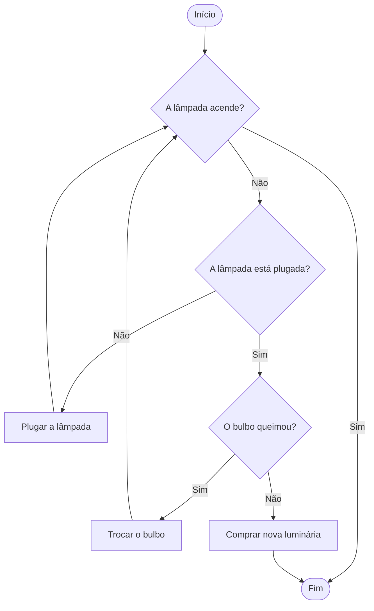
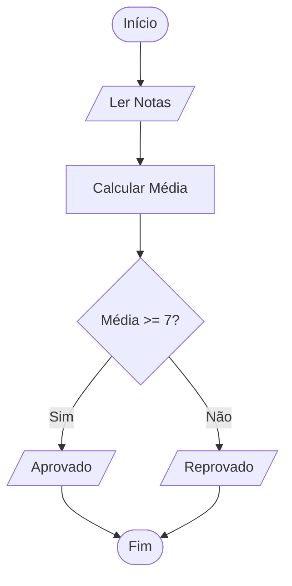

# Aula 01 - Introdução à Lógica de Programação 🧠

!!! tip "Objetivo"
    **Objetivo**: Aprender a "pensar como um computador", entender o que é um algoritmo e como quebrar problemas complexos em passos simples.

---

## 1. O que é um Algoritmo? 💡

A palavra pode assustar, mas você usa algoritmos o tempo todo. Um **Algoritmo** nada mais é do que uma **sequência de passos finitos e precisos para resolver um problema**.

!!! note "Conceito Chave"
    **Conceito Chave**: Um algoritmo precisa ter um **início**, um **fim**, e cada passo não pode gerar dúvidas (ambiguidade).

### Visualizando um Algoritmo (Mermaid)
Vamos imaginar o algoritmo para "Trocar uma Lâmpada".



---

## 2. Abstração e Decomposição 🧩

Para escrever bons programas, usamos dois superpoderes:

1.  **Decomposição**: Quebrar um problema gigante em pedaços menores.
    *   *Ex: Construir uma casa -> Fazer a fundação -> Levantar paredes -> Telhado.*
2.  **Abstração**: Focar no que importa e ignorar os detalhes irrelevantes.
    *   *Ex: Ao dirigir, você foca no volante e pedais, ignorando como o motor queima o combustível.*

### 3. Reconhecimento de Padrões 🔍
Identificar similaridades entre problemas diferentes para aplicar soluções conhecidas.

*   *Ex: Se você sabe dirigir um carro, é mais fácil aprender a dirigir um caminhão, porque o **padrão** (volante, pedais, marchas) é similar.*

---

## 3. Fluxogramas: A Linguagem Universal 🗺️
Se quisermos calcular a média de um aluno, não precisamos saber o nome dele ou o que ele comeu. Precisamos apenas das **NOTAS**.

```txt
ALGORITMO CalcularMedia
   LER Nota1
   LER Nota2
   LER Nota3
   Media = (Nota1 + Nota2 + Nota3) / 3
   ESCREVER Media
FIM_ALGORITMO
```

---

## 3. Fluxogramas: A Linguagem Universal 🗺️

Antes de escrever código, desenhamos. O **Fluxograma** usa formas geométricas para representar os passos.

| Símbolo | Nome | Função |
| :---: | :--- | :--- |
| `([ ... ])` | Terminador | Início ou Fim |
| `[ ... ]` | Processo | Cálculo ou Ação |
| `/ ... /` | Dados | Entrada (Ler) ou Saída (Escrever) |
| `{ ... }` | Decisão | Uma pergunta (Sim/Não) |

### Exemplo: Passou de Ano?



---

## 4. O Próximo Passo: VisualG 💻

Para sair do papel e ver o algoritmo "rodar", usaremos o **VisualG**. Ele é um interpretador de algoritmos em português (Portugol).

!!! example "Exemplo de Código VisualG"
    ```visualg
    Algoritmo "OlaMundo"
    Inicio
       Escreval("Olá, Mundo!")
    FimAlgoritmo
    ```
    Não se preocupe em entender agora, veremos isso na **Aula 02**!

---

### Mão na Massa: O Pensamento Computacional 💻

Antes de programar, simulamos no terminal mental:

<div class="termy" data-termynal markdown="1">
    <span data-ty="input">pensar como programador</span>
    <span data-ty>Analisando problema...</span>
    <span data-ty>Decompondo em passos...</span>
    <span data-ty>Abstraindo detalhes...</span>
    <span data-ty>PADRÃO ENCONTRADO! 🚀</span>
</div>

---

## 5. Mini-Projeto: O Algoritmo da Vida 🚀

Nesta aula, seu mini-projeto é criar um **Fluxograma Digital**. 

!!! info "Desafio do Projeto"
    Escolha um hábito diário (ex: fazer academia, estudar inglês, cozinhar) e transforme em um fluxograma usando as formas geométricas que aprendemos. 
    Você deve apresentar pelo menos **2 decisões** (losangos) e **4 processos** (retângulos).

---

## 6. Exercícios de Fixação 📝

1.  **Fácil**: Escreva um algoritmo (em português) para fazer um café. Lembre-se de verificar se tem pó e água!
2.  **Médio**: Desenhe (no papel ou mentalmente) um fluxograma para atravessar a rua com segurança.
3.  **Desafio**: Um fazendeiro precisa atravessar um rio com um lobo, uma ovelha e uma alface. O barco só leva o fazendeiro e mais um item.
    *   Se o lobo ficar sozinho com a ovelha, ele a come.
    *   Se a ovelha ficar sozinha com a alface, ela a come.
    *   **Algoritmo**: Qual a sequência de viagens para levar todos pro outro lado?
    
    ??? tip "Dica do Desafio"
        O fazendeiro pode *trazer* algo de volta também! Tente levar a ovelha primeiro.

---
**Próxima Aula**: Vamos preparar nosso [Ambiente e Ferramentas](./aula-02.md) para começar a programar de verdade!