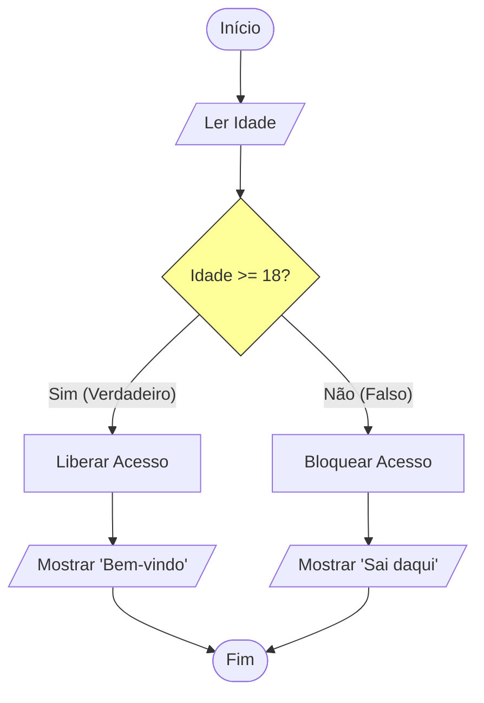

# Aula 04 - Estrutura Condicional 🔀

!!! tip "Objetivo"
    **Objetivo**: Ensinar o computador a tomar decisões baseadas em perguntas (Se/Então).

---

## 1. O Desvio Lógico ("Se...") 🤔

Até agora, nossos programas eram uma linha reta. Mas a vida é cheia de "Se":
*   **SE** chover, levo guarda-chuva.
*   **SENÃO**, vou de óculos escuros.

### Visualizando a Decisão (Mermaid)



---

## 2. Sintaxe Básica (Se-Entao-Senao) 📝

Em Portugol, a estrutura é muito legível.

```portugol
se (idade >= 18) entao
   escreva("Maior de idade")
senao
   escreva("Menor de idade")
fimse
```

### Operadores Relacionais (A Pergunta)
Para fazer a pergunta dentro do `se`, usamos comparadores:

| Símbolo | Significado | Exemplo | Resultado |
| :---: | :--- | :--- | :--- |
| `>` | Maior que | `10 > 5` | Verdadeiro |
| `<` | Menor que | `5 < 10` | Verdadeiro |
| `==` | Igual a | `5 == 5` | Verdadeiro |
| `!=` | Diferente | `5 != 3` | Verdadeiro |
| `>=` | Maior ou Igual | `10 >= 10` | Verdadeiro |

---

---

## 3. Operadores Lógicos (Combinando Perguntas) 🔗

Às vezes, uma única condição não basta.

| Operador | Significado | Exemplo | Regra |
| :---: | :--- | :--- | :--- |
| `E` | E (And) | `x > 5 E x < 10` | Verdadeiro só se **AMBOS** forem verdadeiros. |
| `OU` | OU (Or) | `dia == "Sábado" OU dia == "Domingo"` | Verdadeiro se **PELO MENOS UM** for verdadeiro. |
| `NÃO` | NÃO (Not) | `NÃO (x > 0)` | Inverte o resultado (Vira Falso). |

!!! info "Tabela Verdade (Resumida)"
    *   **V e V = V**
    *   **V e F = F**
    *   **V ou F = V**
    *   **F ou F = F**

---

## 4. Múltiplas Escolhas (Switch/Caso) 🚦

Quando temos muitas opções fixas (Menu), usar vários `se` fica feio. Usamos a estrutura **Escolha-Caso**.

```portugol
escolha (opcao)
   caso 1
      escreva("Ligando...")
   caso 2
      escreva("Reiniciando...")
   caso 3
      escreva("Sair")
   outrocaso
      escreva("Opção Inválida")
fimescolha
```

### Simulando um Menu (Termynal)

<div data-termynal class="termy">
    <span data-ty="input">./menu_sistema</span>
    <span data-ty>1. Iniciar</span>
    <span data-ty>2. Configurações</span>
    <span data-ty>3. Sair</span>
    <span data-ty>Digite sua opção: 2</span>
    <span data-ty="progress">Abrindo Configurações...</span>
</div>

---

---

## 5. Mini-Projeto: Calculadora de IMC 🚀

Vamos aplicar as condicionais em algo prático e saudável.

!!! info "Desafio do Projeto"
    Crie um algoritmo que receba o **Peso** e a **Altura** de uma pessoa.
    1. Calcule o IMC: $IMC = Peso / (Altura \cdot Altura)$.
    2. Mostre a classificação:
        *   Menor que 18.5: Abaixo do peso
        *   Entre 18.5 e 24.9: Peso normal
        *   A partir de 25: Sobrepeso
    Use `se...entao...senao` para decidir.

---

## 6. Exercícios de Fixação 📝

1.  **Fácil (Par ou Ímpar)**: Leia um número inteiro. Se o resto da divisão por 2 for 0 (`num % 2 == 0`), escreva PAR, senão, ÍMPAR.
2.  **Médio (Média)**: Leia 2 notas. Calcule a média.
    *   Se média >= 7: APROVADO.
    *   Se média >= 5 e < 7: RECUPERAÇÃO.
    *   Se média < 5: REPROVADO.
3.  **Desafio (Bhaskara)**: Leia A, B e C. Calcule o Delta (`B*B - 4*A*C`).
    *   Se Delta < 0: Não existe raiz real.
    *   Se Delta >= 0: Calcule e mostre X1 e X2.
    
    ??? tip "Dica: Raiz Quadrada"
        No VisualG, use a função `RaizQ(Delta)` para calcular $\sqrt{\Delta}$.

---
**Próxima Aula**: Como repetir uma tarefa 1000 vezes sem escrever 1000 linhas? [Estruturas Repetitivas](./aula-05.md).