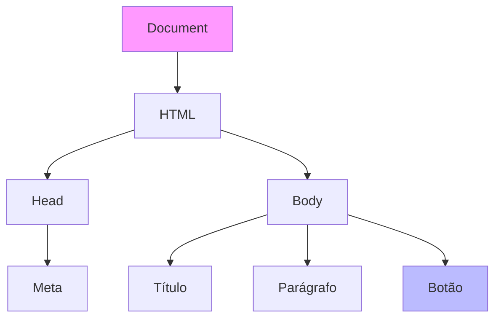

# Aula 10 - Web Moderna: JavaScript e TypeScript 🌐

---

!!! tip "Objetivo"
    **Objetivo**: Entender o papel do JavaScript na web e como o TypeScript ajuda a escrever códigos mais robustos e seguros.

---

## 4. Mini-Projeto: To-Do Console 🚀

JS é excelente para manipular listas e objetos.

!!! info "Desafio do Projeto"
    Crie um array (vetor) de objetos chamado `tarefas`. Cada objeto deve ter `descricao` e `concluida` (booleano).
    1. Adicione 3 tarefas iniciais.
    2. Crie uma função que liste apenas as tarefas que NÃO foram concluídas.
    3. Use o Node.js para rodar seu script no terminal.

---

## 5. Exercícios de Fixação 📝

O JavaScript (JS) é a única linguagem que roda nativamente em todos os navegadores.
Ele manipula o **DOM** (Document Object Model), que é a estrutura da página HTML.

### Visualizando o DOM (Mermaid)



---

## 2. JavaScript: Dinamismo ⚡

```javascript
// Seleciona o botão e adiciona um evento
const botao = document.querySelector('button');

botao.addEventListener('click', () => {
    alert("Você clicou no botão!");
});
```

### Node.js: JS fora do Navegador
Hoje, JS também roda no servidor com o **Node.js**.

<div data-termynal class="termy">
    <span data-ty="input">node servidor.js</span>
    <span data-ty="progress">Servidor rodando na porta 3000...</span>
</div>

</div>

### A Revolução do Express.js
Para criar sites complexos, usamos *frameworks*. O **Express** é o padrão da indústria.

```javascript
const express = require('express');
const app = express();

app.get('/', (req, res) => {
    res.send('Olá do Backend!');
});

app.listen(3000);
```

---

## 3. Variáveis Modernas (Esqueça o `var`) 🆕

O JS é "fracamente tipado" (você pode somar texto com número e ele deixa). O TypeScript (TS) adiciona **Tipagem Estática** para evitar erros bobos.

| Código JS (Suscetível a erro) | Código TS (Seguro) |
| :--- | :--- |
| `function soma(a, b) { return a + b; }` | `function soma(a: number, b: number): number { return a + b; }` |

!!! note
    O navegador não entende TS. Ele precisa ser **transpilado** para JS.

---

## 4. Exercícios de Fixação 📝

1.  **Fácil**: Crie um arquivo HTML com um botão. Use JS para mudar a cor de fundo da página quando clicar nele.
2.  **Médio (Node)**: Crie um script `tabuada.js` que mostre a tabuada do 7 no terminal.
3.  **Desafio (TS)**: Crie uma interface `Pessoa` com nome e idade. Crie uma função que receba um objeto desse tipo e diga se é maior de idade.

---
**Próxima Aula**: O gigante corporativo. Vamos aprender sobre Classes e Objetos robustos com [Java](./aula-11.md).