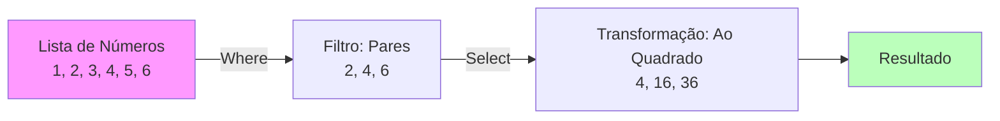

# Aula 12 - Ecossistema Microsoft: C# e .NET 🔷

!!! tip "Objetivo"
    **Objetivo**: Produtividade máxima. Aprender a linguagem C# e a plataforma .NET, muito usadas em empresas.

---

## 1. O Que é .NET? 🏗️

Não confunda: **C#** é a linguagem. **.NET** é a plataforma (bibliotecas, runtime, ferramentas).
É similar ao Java, mas com foco extremo em facilidade de uso e integração.

---

## 2. Ferramentas: Onde programar? 🛠️

*   **Visual Studio (Roxo)**: A IDE completa. Pesada, mas quase programa por você.
*   **VS Code (Azul)**: Leve, rápido e funciona em qualquer lugar.

### Criando um Projeto (Termynal)

<div data-termynal class="termy">
    <span data-ty="input">dotnet new console -o MeuApp</span>
    <span data-ty="progress">Restoring packages...</span>
    <span data-ty="input">cd MeuApp</span>
    <span data-ty="input">dotnet run</span>
    <span data-ty>Hello, World!</span>
</div>

---

## 3. LINQ: A Mágica do C# 🪄

O recurso mais amado do C#. Permite tratar listas como se fossem banco de dados.

### Visualizando o LINQ (Mermaid)



### Código C#

```csharp
int[] numeros = { 1, 2, 3, 4, 5, 6 };

var resultado = numeros
    .Where(n => n % 2 == 0) // Filtra pares
    .Select(n => n * n)     // Eleva ao quadrado
    .ToList();

// Resultado: 4, 16, 36
```

---

## 4. F# : O Lado Funcional (Bônus) 🟣

O .NET também tem uma linguagem chamada **F#**, focada em matemática e funções puras. O C# pegou muitas ideias dela (como o LINQ e as expressões lambda).

```fsharp
// Exemplo em F#
let dobrar x = x * 2
let resultado = dobrar 5 // 10
```

---

---

## 5. Mini-Projeto: Dashboard de Vendas com LINQ 🚀

O C# é extremamente poderoso para processar coleções de dados de forma expressiva.

!!! info "Desafio do Projeto"
    Crie uma lista de objetos `Venda` (Produto, Valor, Data).
    1. Use LINQ para calcular o valor total das vendas.
    2. Liste apenas as vendas acima de R$ 100,00 ordenadas por valor.
    3. Mostre o resultado no console de forma organizada.

---

## 6. Exercícios de Fixação 📝

1.  **Fácil**: Crie um programa C# "Olá Mundo" no Console.
2.  **Médio (LINQ)**: Dada uma lista de nomes `["Ana", "Bruno", "Carlos", "Amanda"]`, use LINQ para filtrar apenas os que começam com "A".
    ??? tip "Dica: StartsWith"
        Use `.Where(nome => nome.StartsWith("A"))`.
3.  **Desafio (Mini-Sistema)**: Crie uma classe `Produto` (Nome, Preço). Crie uma lista de produtos. Use LINQ para achar o produto mais caro e a média de preços.

---
**Próxima Aula**: A linguagem da Ciência de Dados e IA: [Python](./aula-13.md).